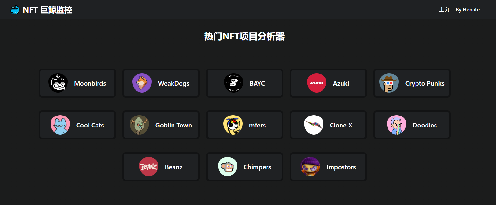
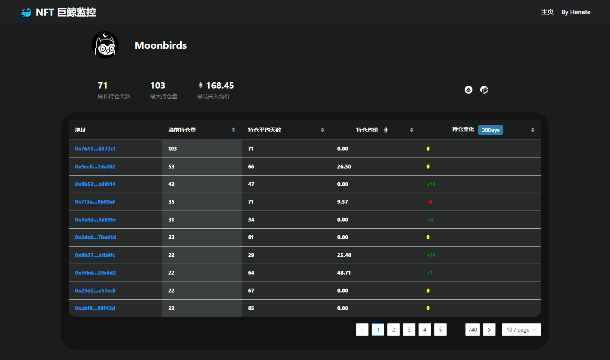
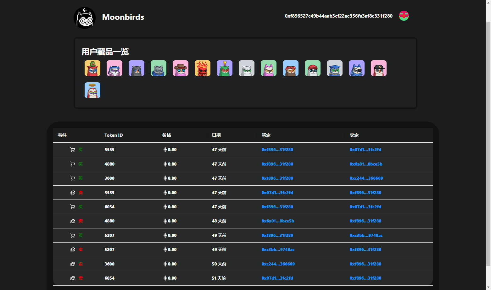

# README

##  00 / 安装

🌟拉取源码

```bash
git clone https://github.com/Henate/NFT_Whale_Watcher.git
```


## 01 / 项目结构

📁stats：NFT 信息抓取

📁server：小型服务器，提供网页渲染数据

📁app：NFT Whale Watcher 源码


## 02 / 搭建自己的NFT数据分析器

### 1. 抓取需分析的NFT项目

#### 1）进入stats

```
cd stats
```

#### 2）自定义分析 NFT 项目

在这里填写你喜爱的 NFT 合约地址

如果不清楚 NFT 项目合约地址，请前往[opensea](https://opensea.io/)寻找你喜爱的 NFT

```js
const contractAddress = "0xBC4CA0EdA7647A8aB7C2061c2E118A18a936f13D"; // Bored Ape Yacht Club
```

自定义数据生成文件名

```js
fs.writeFile("BAYCOwner.json", jsonContentOwners, "utf8", function (err)
fs.writeFile("BAYCHistory.json",jsonContentHistory,"utf8",function (err)
```

#### 3）启动下载

部署脚本下载

```js
node stats.js
```

脚本执行完毕后，当前路径下将生成`BAYCOwner.json` & `BAYCHistory.json`

手动把该两个文件格式化为js格式文件，导入到📁server中


### 2. 部署服务器

切换到📁server进行脚本部署，当前项目默认运行到端口4000中

```bash
cd ../server
node index.js
```


### 3. 部署前端业务

切换到📁app进行脚本部署

```bash
cd ../app
yarn start
```


### 4.部署成功🎉




## 使用方法

点击自己感兴趣的项目图标，如Moonbirds

项目主页面有四大功能

✨**当前持仓量**

✨**持仓平均天数**

✨**持仓均价**

✨**持仓变化 30Days**

🎈🎈欢迎探索更多功能，更多功能将持续开发🎈🎈




点击持仓用户地址，你甚至能够发现所有买卖记录！




